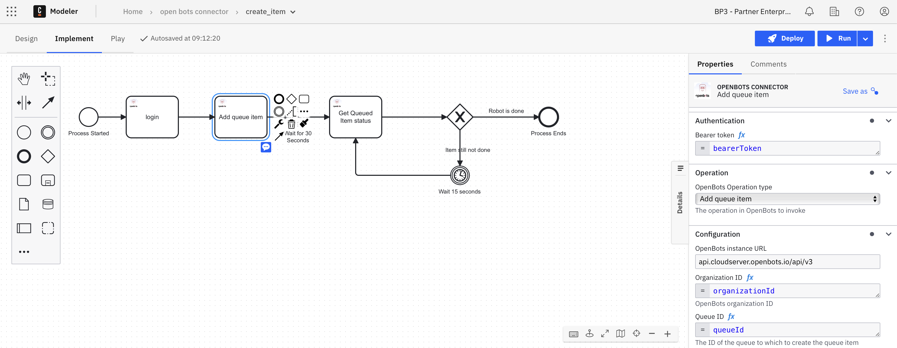

# Camunda OpenBots Custom Connector Template
This project contains a custom Camunda 8 Connector template that provides access to OpenBots operations.

# How to install the connector

## With Web Modeller
The following instructions detail how to install the connector template when using the Web Modeller, which can be used in a SaaS or Self-Managed environment: https://docs.camunda.io/docs/components/connectors/manage-connector-templates/#importing-existing-connector-templates

## Within Desktop Modeller
The following instructions detail how to install the connector template when using the Desktop Modeller, which can be used in a SaaS or Self-Managed environment:: https://docs.camunda.io/docs/components/modeler/desktop-modeler/element-templates/configuring-templates/

# How to use the Connector in a model?
First the Connector template needs to be uploaded to the project. Then, it can be used within a process model, for example:

# Supported Operations
Links below take you to the OpenBots documentation for the specific API
1. [Login to OpenBots](https://api.cloudserver.openbots.io/swagger/index.html) and retrieve a session token
2. [Add item to Queue](https://api.cloudserver.openbots.io/swagger/index.html))
3. [Get queue item status](https://api.cloudserver.openbots.io/swagger/index.html)

# Prerequisites
1. You will need to have a queue created on OpenBots.
2. You will need `Bearer Token`, `Organisation ID`, `Openbots instance URL`, `Queue name`, `Queue ID` for the connector. These may be stored as secrets.

# Element Template
The element template can be found in the `element-templates/openbots_connector.json` file.

# Contributing
To contribute to this connector, see the [CONTRIBUTING](CONTRIBUTING.md) file.
